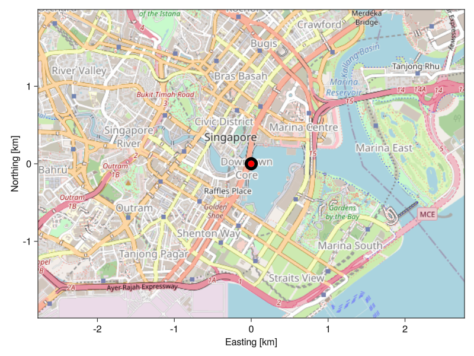

# MapMakie.jl - OpenStreetMap in Makie

## Installation

```julia
julia> using Pkg; Pkg.add(url="https://github.com/subnero1/MapMakie.jl")
```

## Example Usage

```julia
function webmercator(lat, lon)
    return (
        lon/360 + 0.5,
        0.5 - log(tand(45+lat/2))/(2π)
    )
end

origin = webmercator(1.286770, 103.854307) # The Merlion, Singapore
f = Figure(resolution = 400 .* (4,3))
a = MapAxis(
    f[1,1];
    origin,
    limits = (-1,1,-1,1)./40_000,
)
scatter!(
    a,
    Point2f[(0,0)],
    color = :red,
    markersize = 30,
    strokewidth = 10,
)
display(f)
```

